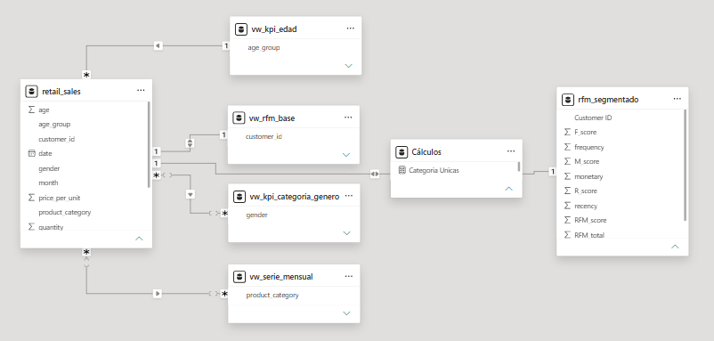

# 📊 Modelo de Datos

Para garantizar una arquitectura escalable, un rendimiento óptimo de las medidas DAX y un filtrado interactivo eficiente, se implementó un modelo de datos basado en un **Esquema en Estrella (Star Schema)**.

## 🧩 Diseño del Modelo de Datos

---

## 📌 Descripción del Modelo

El modelo está diseñado para analizar el desempeño comercial, la conversión y la rentabilidad, permitiendo una visión integral del embudo y del ROI.

El modelo consta de:

### 🔹 Tabla de Dimensión
**Calendario**
- Tabla de fechas generada para análisis temporal.
- Permite segmentar la información por periodos.
- Creada dinámicamente en DAX.
- Campos:
- Año 
- Mes 
- Nombre Mes 
- Año-Mes
- Permite análisis temporal consistente en todo el dashboard.

---

### 🔹 Tabla de Medidas
**Cálculos**
- Contiene exclusivamente las medidas DAX del modelo.
- Permite centralizar la lógica de negocio y mejorar el rendimiento.

---

### 🔹 Tabla de Hechos
**base_comercial**
- Contiene el registro granular de leads, conversiones e ingresos.
- Representa cada interacción o registro dentro del funnel comercial.
- Campos principales:
  	- mql_id (identificador del lead)
 	- fecha
 	- canal / source
 	- segmento
 	- estado / etapa (stage)
 	- revenue (ingreso declarado)

---
**📊 Canal**
- Clasifica el origen de los leads.
- Campos:
 	- Canal 
 	- Tipo de canal 

---

**👥 Segmento**
- Agrupa los leads/clientes según características.
- Campos:
 	- Segmento 
 	- Subsegmento (si aplica) 

---

**🔄 Etapa del Funnel**
- Define el estado del lead dentro del proceso comercial.
- Campos:
 	- Lead 
 	- Calificado 
 	- Propuesta 
 	- Cerrado (closed_won)

---

## 🔗 Relaciones (Modelo Dimensional)

El modelo sigue un enfoque de **estrella extendida**, donde la tabla de hechos central (`retail_sales`) se conecta con múltiples tablas auxiliares y de segmentación para enriquecer el análisis.

### 🧩 **Tabla central (Hechos)**

**retail_sales**

- Tabla principal del modelo
- Contiene el detalle transaccional (nivel granular)
- Es el punto de conexión con todas las dimensiones

---

### 🔗 **Relaciones principales**

| Tabla Origen | Columna | Tabla Destino | Columna | Cardinalidad | Dirección |
|-------------|--------|--------------|--------|--------------|----------|
| retail_sales | customer_id | vw_rfm_base | customer_id | *:1 | Single |
| retail_sales | gender | vw_kpi_categoria_genero | gender | *:1 | Single |
| retail_sales | product_category | vw_serie_mensual | product_category | *:1 | Single |
| retail_sales | age_group | vw_kpi_edad | age_group | *:1 | Single |

---

### 🔗 **Relaciones de segmentación avanzada**

| Tabla Origen | Columna | Tabla Destino | Columna | Cardinalidad | Dirección |
|-------------|--------|--------------|--------|--------------|----------|
| vw_rfm_base | customer_id | rfm_segmentado | Customer ID | 1:1 | Single |
| rfm_segmentado | (medidas) | Cálculos | (medidas) | 1:1 | Single |

---

### 📌 **Características del modelo**

- **Cardinalidad predominante:** 
  - Varios a uno (*:1) desde la tabla de hechos hacia dimensiones 
  - Uno a uno (1:1) en tablas de segmentación (RFM)

- **Dirección de filtro:** 
  - Unidireccional (Single) 
  - Las dimensiones filtran la tabla de hechos 

- **Tipo de modelo:** 
  - Estrella extendida con tablas auxiliares analíticas 

---

### 🧠 **Interpretación del diseño**

- `retail_sales` actúa como el núcleo del modelo 
- Las tablas `vw_kpi_*` funcionan como dimensiones derivadas para análisis específicos 
- `vw_rfm_base` y `rfm_segmentado` permiten análisis avanzado de comportamiento del cliente 
- La tabla **Cálculos** centraliza las medidas DAX sin afectar relaciones físicas

---

## 📐 Diccionario de Métricas (DAX)

🟢 Categorías Únicas: Cantidad de categorías de producto distintas presentes en el dataset. 

    Categoria Unicas = DISTINCTCOUNT(retail_sales[product_category])

🔵 Clientes Únicos: Número total de clientes distintos que han realizado transacciones.

    Clientes Unicos = DISTINCTCOUNT(retail_sales[customer_id])

🟢 Crecimiento de Ingresos MoM %: Variación porcentual de los ingresos respecto al mes anterior (Month over Month).

    Ingreso MoM % = 
    VAR mes_actual = CALCULATE([Ingreso Total])
    VAR mes_anterior = CALCULATE([Ingreso Total], PREVIOUSMONTH(retail_sales[date]))
    RETURN DIVIDE(mes_actual - mes_anterior, mes_anterior, 0)

🟤 Ingreso por Categoría: Promedio de ingresos generados por cada categoría de producto.

    Ingreso por Categoria = DIVIDE([Ingreso Total], [Categoria Unicas], 0)

🔴 Ingreso por Cliente: Promedio de ingresos generados por cada cliente único.

    Ingreso por Cliente = DIVIDE([Ingreso Total], [Clientes Unicos], 0)

🟣 Ingreso Total: Suma total de los ingresos generados por todas las transacciones.

    Ingreso Total = SUM(retail_sales[total_amount])

🔷 Participación por Categoría %: Porcentaje de contribución de cada categoría sobre el total de ingresos.

    Participacion Categoria % = 
    DIVIDE([Ingreso Total], CALCULATE([Ingreso Total], ALL(retail_sales[product_category])))

🟠 Ticket Promedio: Promedio de ingresos generados por cada cliente único.

    Ticket Promedio = DIVIDE([Ingreso Total], [Total Transacciones], 0)

🟡 Total Transacciones: Cantidad total de registros o transacciones realizadas.

    Total Transacciones = COUNTROWS(retail_sales)

---

## 📑 Estructura del Dashboard

### 📍 Página 1: Informe General

**🎯 Objetivo:** Proporcionar una visión global del desempeño del negocio.

**📊 Componentes:**
- 💰 **KPIs principales**
  - Ingreso Total  
  - Clientes Únicos  
  - Ticket Medio  
  - Total de Transacciones  

- 📈 **Evolución mensual**
  - Tendencia del ingreso total por mes  

- 🧩 **Análisis por categoría**
  - Distribución de ingresos por categoría  
  - Participación porcentual por categoría  

- 👥 **Análisis por categoría y género**
  - Comparación de ingresos segmentados  

- 🎛️ **Filtros disponibles**
  - Categoría  
  - Género  
  - Mes  

---

### 📍 Página 2: Informe por Clasificación

**🎯 Objetivo:** Analizar el comportamiento del negocio por segmentos demográficos y categorías.

**📊 Componentes:**
- 🎂 **Ingreso por rango de edad**
  - Comparación de ingresos entre grupos etarios  

- 📋 **Indicadores por categoría**
  - Total de transacciones  
  - Ticket medio  
  - Ingresos totales  

- 🔄 **Relación Ticket Medio vs Transacciones**
  - Análisis de correlación entre volumen y valor  

- ⚖️ **Análisis comparativo**
  - Desempeño por categoría y rango de edad  

- 🎛️ **Filtros disponibles**
  - Categoría  
  - Rango de edad  
  - Mes  

---

### 📍 Página 3: Segmentación de Clientes

**🎯 Objetivo:** Identificar y analizar grupos de clientes para estrategias de fidelización.

**📊 Componentes:**
- 🧠 **Segmentación de clientes**
  - Campeón  
  - Cliente Leal  
  - En riesgo  
  - Potencial  
  - Perdido  

- 🧩 **Distribución de clientes**
  - Participación por segmento  

- 📄 **Detalle de clientes**
  - ID Cliente  
  - Segmento  
  - Días desde última compra (Recencia)  
  - Frecuencia de compra  
  - Monto gastado  

- 📊 **Análisis RFM**
  - Recencia  
  - Frecuencia  
  - Valor  

- ⭐ **Identificación de clientes clave**
  - Segmentos prioritarios para acciones comerciales  

- 🎛️ **Filtros disponibles**
  - Categoría  
  - Rango de edad  
  - Mes  

---

## 🚀 Conclusión Técnica

El modelo en estrella permite:

- Alto rendimiento en Power BI
- Escalabilidad del modelo
- Claridad en relaciones
- Optimización de medidas DAX

