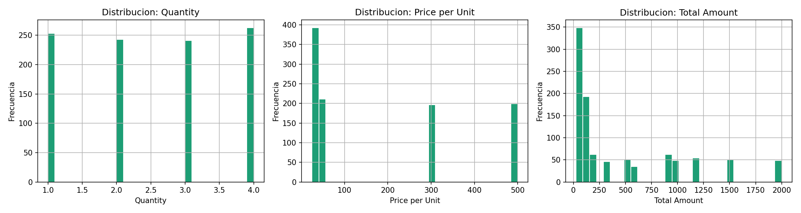
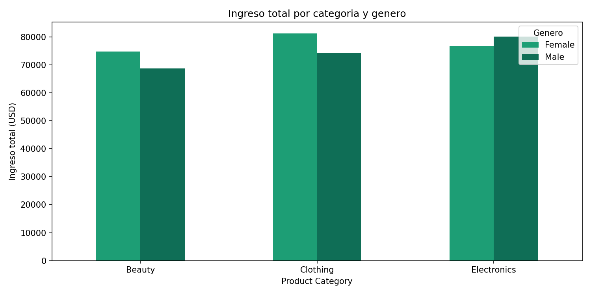
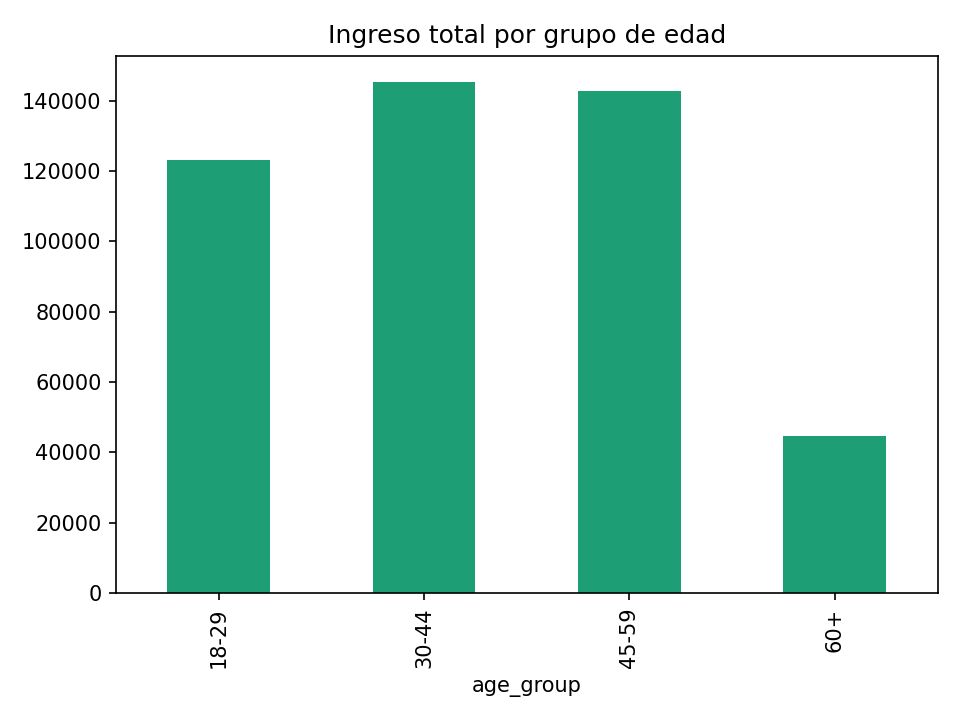
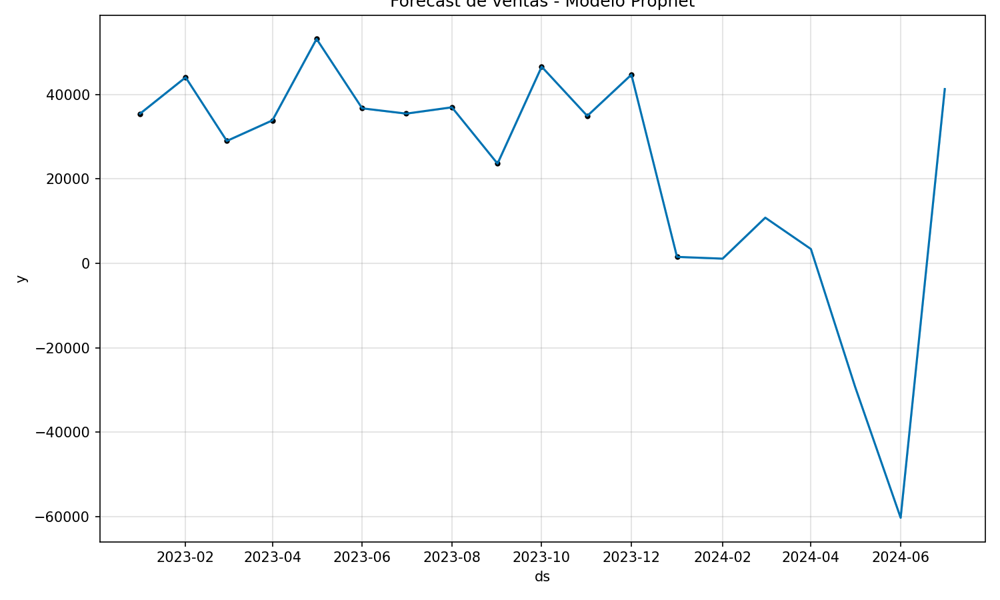

## 🐍 Procesamiento y Análisis en Python

Como parte del desarrollo del dashboard **RetailX Analytics**, se realizó un proceso de preparación, análisis y generación de visualizaciones en Python, siguiendo el instructivo proporcionado.

### 🔧 Preparación de Datos
- Carga del dataset de ventas retail  
- Limpieza y validación de datos (valores nulos, formatos de fecha, tipos de datos)  
- Transformación de variables clave como:
  - Fecha (para análisis temporal)
  - Categoría de producto
  - Segmentación de clientes  

---

### 📊 Análisis Exploratorio
- Evaluación del comportamiento de ventas a lo largo del tiempo  
- Identificación de patrones por categoría, género y rango de edad  
- Cálculo de métricas clave:
  - Ingreso total  
  - Ticket promedio  
  - Frecuencia de compra  
  - Clientes únicos  

---

### 🧠 Segmentación de Clientes (RFM)
- Construcción del modelo **RFM (Recencia, Frecuencia, Valor)**  
- Asignación de scores a cada cliente  
- Clasificación en segmentos:
  - Campeones  
  - Clientes leales  
  - En riesgo  
  - Potenciales  
  - Perdidos  

---

### 📈 Generación de Visualizaciones
Se desarrollaron gráficos en Python para analizar y validar insights antes de su implementación en Power BI:

- **Comportamiento de ventas**

- **Ingresos por categoría**

- **Análisis por rango de edad**

- **Predicción de ventas mensuales**

