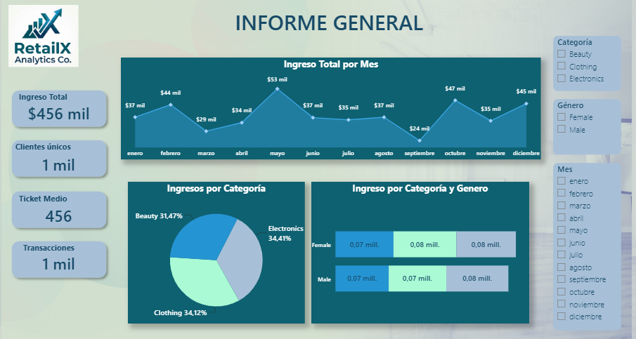
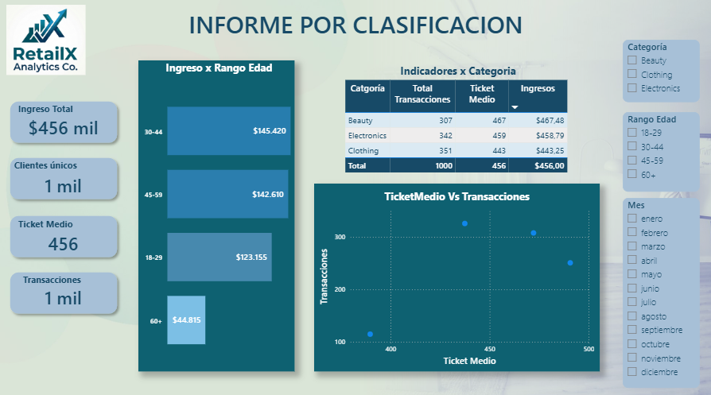
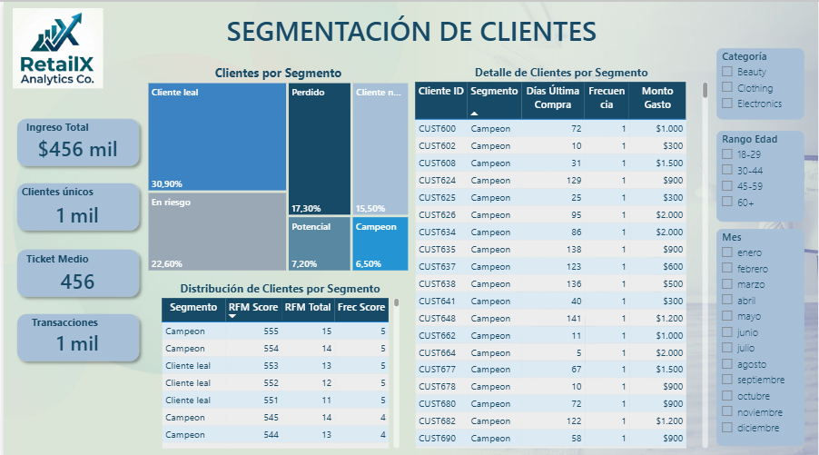

# 📊 RetailX Analytics | Dashboard de Rentabilidad y ROI por Canal

Proyecto de analítica de datos enfocado en la construcción de un **dashboard ejecutivo en Power BI**, orientado a la toma de decisiones estratégicas en un entorno retail.

Este proyecto integra procesos de **ETL, modelado de datos, análisis exploratorio, segmentación de clientes (RFM)** y **forecasting**, culminando en una solución visual interactiva para negocio.

---

## 🧩 Contexto del negocio

**RetailX Analytics Co.** es una cadena de retail multicanal orientada al segmento masivo (mid-market), enfocada en la venta directa al consumidor final (B2C). Su operación abarca diferentes categorías de producto como **Beauty, Clothing y Electronics**, atendiendo a clientes entre los **18 y 64 años**.

En un entorno altamente competitivo, la compañía enfrenta el desafío de crecer de forma sostenible, no solo aumentando el volumen de ventas, sino optimizando la **rentabilidad comercial y el retorno sobre la inversión (ROI)** de sus canales de adquisición.

### 🎯 Objetivo de negocio

Maximizar la rentabilidad y el ROI, identificando qué segmentos de clientes generan mayor valor y cómo reasignar la inversión comercial hacia aquellos grupos más eficientes.
El objetivo es:
- Analizar la **rentabilidad comercial**
- Identificar **segmentos de clientes de alto valor**
- Evaluar el **comportamiento de ventas en el tiempo**
- Proyectar demanda futura mediante modelos predictivos
- Generar **insights accionables para la toma de decisiones**

---

## 🛠️ Stack tecnológico

- **Excel** → Preparación y exploración inicial de datos 
- **SQL** → Transformación y modelado de datos 
- **Python** → Análisis avanzado, segmentación y forecasting 
- **Power BI** → Visualización, storytelling y toma de decisiones

---

## 🧩 Arquitectura del Proyecto

El proyecto sigue un flujo completo de analítica:

1. **Extracción y limpieza de datos (SQL / Excel)**
2. **Transformación y modelado (SQL Server)**
3. **Análisis exploratorio (Python)**
4. **Segmentación de clientes (RFM)**
5. **Forecast de ventas (Prophet)**
6. **Visualización en Power BI**

---

## 📊 Dashboard

### 📍 Informe General


### 📍 Informe por Clasificación


### 📍 Segmentación de Clientes


---

## 🔍 Principales hallazgos

- No siempre el segmento con más clientes es el más rentable  
- Los clientes **“Campeón”** concentran gran parte del ingreso  
- Existe un grupo de clientes **en riesgo recuperable**  
- El **ingreso por cliente** es clave para priorizar inversión  
- El forecast permite anticipar la demanda y optimizar decisiones  

## 📁 Estructura del repositorio
Estructura del repositorio y organización de los archivos del proyecto:

```text
RetailX_Dashboard-Hub/
├── assets/
│   └── BI Informe General.PNG
│   └── BI Informe Segmento.PNG
│   └── BI Segmentacion RFM.PNG
│   └── distribucion_numericas.png
│   └── Estrella.PNG
│   └── forecast_prophet.png
│   └── ingreso_categoria_genero.png
│   └── ingreso_por_edad.png
│   └── RFM.PNG
├── data/
│   └── forecast_prophet.csv
│   └── retail_sales_dataset.csv
│   └── RetailX_Proyecto.xlsx
│   └── rfm_segmentado.csv
│   └── vw_kpi_categoria_genero.csv
│   └── vw_kpi_edad.csv
│   └── vw_rfm_base.csv
│   └── vw_serie_mensual.csv
├── docs/
│   ├── 01_problema_y_objetivos.md
│   ├── 02_diccionario_de_datos.md
│   ├── 03_metodologia.md
│   └── 04_hallazgos_y_recomenda.md
├── powerbi/
│   └── RetailX_Dashboard.pbix
├── python/
│   └── analisisproyecto3.ipynb
├── sql/
│   └── SQLQuery1.sql
└── README.md
```
---

## 🔍 Insights Clave

- **El volumen no equivale a rentabilidad**  
  Se identifican segmentos con alto número de transacciones pero bajo ticket promedio, lo que reduce su aporte real al negocio.

- **Los clientes “Campeón” concentran el valor**  
  Un pequeño porcentaje de clientes genera una proporción significativa del ingreso total, evidenciando una fuerte concentración de valor.

- **Existe una base importante de clientes en riesgo**  
  Clientes con alta frecuencia histórica pero baja recencia representan oportunidades claras de reactivación.

- **Diferencias claras por segmento demográfico**  
  La combinación de edad, género y categoría influye directamente en el ingreso y comportamiento de compra.

- **Desbalance en la eficiencia comercial**  
  Algunos canales o segmentos presentan alto volumen pero bajo ROI, indicando ineficiencia en la inversión.

- **Patrones de demanda predecibles**  
  El análisis de series temporales permite identificar tendencias y estacionalidades útiles para planificación.

---

## 💡 Recomendaciones de Negocio

- **Reasignar inversión hacia segmentos de alto valor**  
  Priorizar clientes con mayor ingreso por cliente y mejor ROI en lugar de enfocarse únicamente en volumen.

- **Diseñar estrategias de retención para clientes “Campeón”**  
  Implementar beneficios exclusivos, programas de fidelización o experiencias personalizadas.

- **Activar campañas de reactivación para clientes en riesgo**  
  Utilizar descuentos dirigidos o comunicación personalizada para recuperar su valor potencial.

- **Optimizar la inversión en canales de bajo rendimiento**  
  Reducir o ajustar el gasto en segmentos con bajo ROI y alta adquisición de bajo valor.

- **Ajustar portafolio y promociones según demanda proyectada**  
  Utilizar el forecast para anticipar inventario y planificar campañas comerciales.

- **Enfocar la estrategia en eficiencia, no solo en crecimiento**  
  Medir el éxito no solo por ventas, sino por rentabilidad y costo de adquisición.

---

## 📈 Impacto Esperado

- **Incremento del ROI comercial**  
  Mejor asignación del presupuesto hacia segmentos más rentables.

- **Aumento del ingreso por cliente**  
  Enfoque en clientes de alto valor y estrategias de fidelización.

- **Reducción del CAC (Costo de Adquisición)**  
  Optimización de canales y mejora en la eficiencia de conversión.

- **Mejora en la retención de clientes**  
  Disminución de churn mediante estrategias de reactivación.

- **Optimización de inventario y planificación**  
  Decisiones basadas en forecast que reducen sobrestock o quiebres.

- **Toma de decisiones basada en datos**  
  Visibilidad clara de KPIs y desempeño a través del dashboard en Power BI.

